# mysql 备忘录

* 监控sql执行情况的手段
* 利用执行计划explain优化sql
* 怎么判定sql需要优化
* 如何建表以及如何优化表结构
* 如何优化表结构
* mysql索引为什么用B+树而不用红黑树？
* 索引分类、索引优化原则、索引覆盖、回表、最左匹配
* MTS主从并发复制原理及实操指南
* 搭建 mysql慢查询 错误日志监控平台

---

## 监控sql执行情况的手段

要想进阶针对mysql学习乃至掌握mysql调优的基本技能，监控mysql的执行情况必不可少。就像我们的代码，如果不能debug，想要进行调优排错，难度将会大大增加。

1. (**deprecated**) show profile
    1. 什么是show profile
        show profile是mysql提供的用来分析当前会话中sql语句执行的资源消耗情况，利用它我们可以用来分析sql的性能，作为调优的测量工具
        show profile默认是关闭的，可以通过set profiling=1;指令来开启，但是需要注意的是每次开启只是生效在当前会话中，想要永久生效的话需要修改mysql配置文件
    2. 如何使用show profile
        1. 首先开启show profile，mysql中执行指令
            ```sql
            set profiling=1;
            ```
        2. 运行一段测试sql
            ```sql
            select * from order_info limit 100;
            ```
        3. 执行 `show profiles`; 查询最近执行的sql的情况
            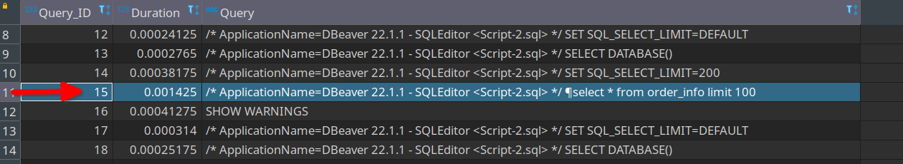
            如上图所示，我们可以看到，我们刚刚执行的这条sql的执行时间为0.001425s，queryId为15
        4. 那么我们还可以通过这个queryId进阶监控这个sql的其他资源消耗情况，比如查询其CPU的消耗情况
            ```sql
            show profile CPU for query 15;
            ```
            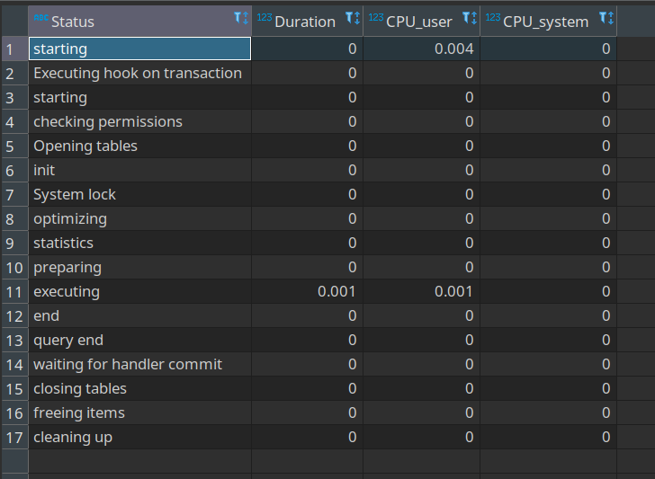
            其中 `status` 表示的是sql指定的各个阶段的状态， `duration` 表示的是各个状态的耗时， `cpu_user` 表示当前用户占用的cpu， `cpu_system` 表示系统占用的cpu

            结果分析：通过上述结果可知，我们执行的sql的大部分时间消耗在启动上，其次消耗在打开table，真正花在执行上的时间只有0.001s

            除了上述演示的监控cpu的资源消耗，show profile还提供了如下的监控类型: 
            |监控类型|语句| 
            |-|-| 
            |显示所有性能信息|all| 
            |显示块IO开销|block io| 
            |显示上下文开销|context switches| 
            |显示用户cpu时间、系统cpu时间|cpu| 
            |显示发送和接收的消息数量|ipc| 
            |显示页错误数量|page faults| 
            |显示源码中的函数名称与位置|source| 
            |显示swap的次数|swaps|

            指令格式: 
            ```sql
            show profile [type] [for query query_id]
            ```

            另外一个常用的指令是show profile;，这个是用于查询最近一个profiling信息

            **注意**: `show profile` 在 `mysql5.7` 中就已经显示过时了，虽然仍然可用，但mysql推荐更还用的 `performance_schema` 语句来监控sql执行情况
2. performance_schema
    1. 什么是performance_schema
        performance_schema实际上是一个数据库，我们可以通过数据库查询指令 `show databases;` 或者像navicat这样的数据库管理软件查看到该数据库。

        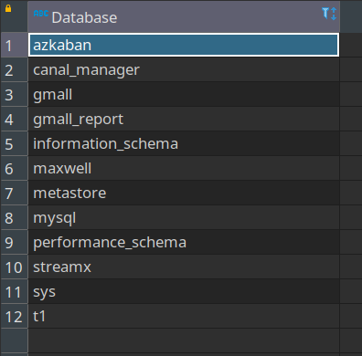

        performance_schema是用于监控mysql在一个较低级别的运行过程中的资源消耗、资源等待的情况。它提供了一系列的表格，这些表格中存储了关于数据库运行期间的性能相关的数据，如磁盘、IO、锁、CPU等相关信息。

        performance_schema比show profile更加详尽，5.6版本后默认是开启的，可以在mysql配置文件中看到配置项

        ```txt
        [mysqld]
        ...
        performance_schema=ON
        ...
        ```
    2. performance_schema表分类 (mysql-8.0.29 110张表)
        |分类|表名| 
        |-|-| 
        |语句事件记录表|show tables like '%statement%';| 
        |当前语句事件表|events_statements_current| 
        |历史语句事件表|events_statements_history| 
        |长语句历史事件表|events_statements_history_long| 
        |摘要表|summary| 
        |等待事件记录表，与语句事件类型的相关记录表类似|show tables like '%wait%';| 
        |阶段事件记录表，记录语句执行的阶段事件的表|show tables like '%stage%';| 
        |事务事件记录表，记录事务相关的事件的表|show tables like '%transaction%';|
        |监控文件系统层调用的表|show tables like '%file%';|
        |监控内存使用的表|show tables like '%memory%';|
        |动态对performance_schema进行配置的配置表|show tables like '%setup%';|
    3. 如何使用performance_schema
        * instruments和consumers
            * instruments：生产者，用于采集mysql中各种各样的操作产生的事件信息，对应setup_instruments配置表中的配置项，也可以称为监控采集配置项
            * consumers：消费者，对应的消费者表用于存储来自instruments采集的数据，对应setup_consumers配置表中的配置项，可以称为消费存储配置项
        
        虽然performance_schema默认是开启的，但是数据库刚启动时并非所有的采集项都打开了，也就是说，默认不会采集所有的事件。

        有可能你需要检测的事件并没有打开，那么就需要我们手动将对应项打开。

        比如打开等待时间的采集器开关，需要修改setup_instruments表中对应的采集器配置项

        ```sql
        update setup_instruments set ENABLED='YES',TIMED='YES' where name like 'wait%'; 
        ```

        打开等待事件的保存表配置开关，需要修改setup_consumers配置表中对应的配置项

        ```sql
        update setup_consumers set ENABLE='YES' where name like '%wait%';
        ```

        **常用查询**
        ```sql
        --1、哪类的SQL执行最多？
        SELECT DIGEST_TEXT,COUNT_STAR,FIRST_SEEN,LAST_SEEN FROM events_statements_summary_by_digest ORDER BY COUNT_STAR DESC
        --2、哪类SQL的平均响应时间最多？
        SELECT DIGEST_TEXT,AVG_TIMER_WAIT FROM events_statements_summary_by_digest ORDER BY AVG_TIMER_WAIT DESC
        --3、哪类SQL排序记录数最多？
        SELECT DIGEST_TEXT,SUM_SORT_ROWS FROM events_statements_summary_by_digest ORDER BY SUM_SORT_ROWS DESC
        --4、哪类SQL扫描记录数最多？
        SELECT DIGEST_TEXT,SUM_ROWS_EXAMINED FROM events_statements_summary_by_digest ORDER BY SUM_ROWS_EXAMINED DESC
        --5、哪类SQL使用临时表最多？
        SELECT DIGEST_TEXT,SUM_CREATED_TMP_TABLES,SUM_CREATED_TMP_DISK_TABLES FROM events_statements_summary_by_digest ORDER BY SUM_CREATED_TMP_TABLES DESC
        --6、哪类SQL返回结果集最多？
        SELECT DIGEST_TEXT,SUM_ROWS_SENT FROM events_statements_summary_by_digest ORDER BY SUM_ROWS_SENT DESC
        --7、哪个表物理IO最多？
        SELECT file_name,event_name,SUM_NUMBER_OF_BYTES_READ,SUM_NUMBER_OF_BYTES_WRITE FROM file_summary_by_instance ORDER BY SUM_NUMBER_OF_BYTES_READ + SUM_NUMBER_OF_BYTES_WRITE DESC
        --8、哪个表逻辑IO最多？
        SELECT object_name,COUNT_READ,COUNT_WRITE,COUNT_FETCH,SUM_TIMER_WAIT FROM table_io_waits_summary_by_table ORDER BY sum_timer_wait DESC
        --9、哪个索引访问最多？
        SELECT OBJECT_NAME,INDEX_NAME,COUNT_FETCH,COUNT_INSERT,COUNT_UPDATE,COUNT_DELETE FROM table_io_waits_summary_by_index_usage ORDER BY SUM_TIMER_WAIT DESC
        --10、哪个索引从来没有用过？
        SELECT OBJECT_SCHEMA,OBJECT_NAME,INDEX_NAME FROM table_io_waits_summary_by_index_usage WHERE INDEX_NAME IS NOT NULL AND COUNT_STAR = 0 AND OBJECT_SCHEMA not in ('mysql','test') ORDER BY OBJECT_SCHEMA,OBJECT_NAME;
        --11、哪个等待事件消耗时间最多？
        SELECT EVENT_NAME,COUNT_STAR,SUM_TIMER_WAIT,AVG_TIMER_WAIT FROM events_waits_summary_global_by_event_name WHERE event_name != 'idle' ORDER BY SUM_TIMER_WAIT DESC
        --12-1、剖析某条SQL的执行情况，包括statement信息，stege信息，wait信息
        SELECT EVENT_ID,sql_text FROM events_statements_history WHERE sql_text LIKE '%count(*)%';
        --12-2、查看每个阶段的时间消耗
        SELECT event_id,EVENT_NAME,SOURCE,TIMER_END - TIMER_START FROM events_stages_history_long WHERE NESTING_EVENT_ID = 1553;
        --12-3、查看每个阶段的锁等待情况
        SELECT event_id,event_name,source,timer_wait,object_name,index_name,operation,nesting_event_id FROM events_waits_history_long WHERE nesting_event_id = 1553;
        ```
    
3. 其他常用监控指令
    1. show processlist 监控连接线程数
        show processlist指令可以查询到mysql当前的连接线程，以此来监控mysql是否有大量线程数连接，从而进行排查
        
        ```sql
        show processlist
        ```

        执行结果

        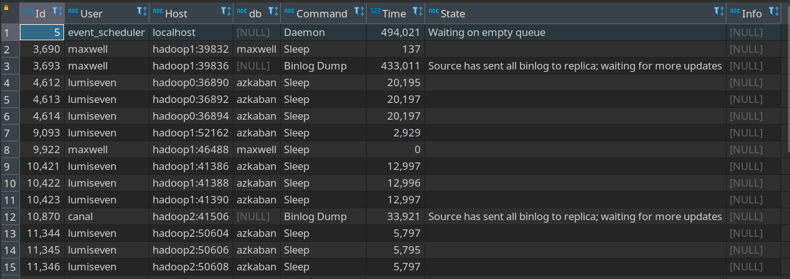

    2. last_query_cost 监控数据页
        mysql中是以数据页为单位来存储数据的，last_query_cost指令用于查询最近一次查询需要查找多少个数据页。查找的数据页越多，IO越高，性能越差

        ```sql
        show status like 'last_query_cost';
        ```

---

## 利用执行计划explain优化sql

在实际开发中，我们往往需要针对某些较为复杂的SQL进行优化，首先我们就需要了解SQL的具体执行情况和过程

1.  什么是explain 如何使用
explain，即执行计划，是mysql提供的用来模拟优化器执行sql语句的指令，用它我们可以知道sql的执行效果，需要注意的是explain是模拟执行，并不是真正的执行，所以其效果分析并不能完全还原真实的执行效果。

explain指令的用法就是explain+要执行的sql，比如

```sql
explain select * from gmall.order_info limit 100;
```

结果显示

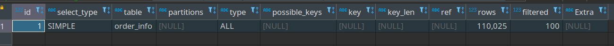

在 [explain官方文档](https://dev.mysql.com/doc/refman/8.0/en/explain-output.html) 中我们可以知道，explain语句输出的内容中包含下列信息： 

| 列名 | 含义 |
| -- | -- |
| id | 语句的唯一标识 |
| select_type | 查询类型 |
| table | 表名 |
| partitions | 分区 |
| type | 连接类型(left join, right join 等) |
| possible_keys | 可能会选择的索引 |
| key | 实际选择的索引 |
| key_len | 索引的长度 |
| ref | 索引的哪一列被谁引用了 |
| rows | 估计要扫描的数据行数 |
| filtered | 符合查询条件的数据百分比 |
| Extra | 扩展项 附加信息 没有定值 根据 sql 显示不同的信息 |

2. 输出信息详解
    1. id 语句的唯一标识
        sql的序列号，表示sql及子句或者操作表的执行顺序，数字越大的越先执行，数字相同的从上往下依次执行，举例说明，我们执行如下的语句
        ```sql
        explain select 
            * 
        from 
            order_info
        where 
            user_id in (select id from user_info)
        ```

        按照我们的正常预期，子查询 `select id from user_info` 肯定是先执行，然后才执行外面的针对 `order` 表的查询，那么我们查看执行计划的结果

        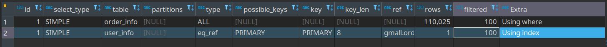

        两个语句的id都是1，但是按照从上往下执行的规则，先执行针对 `order_info` 表的查询，再执行针对 `user_info` 表的查询 并不符合预期

        但从输出可以看到 sql 语句其实已经被优化过，实际执行的语句是:
        ```sql
        select `gmall`.`order_info`.`id` AS `id`,
            `gmall`.`order_info`.`consignee` AS `consignee`,
            -- ... 省略其中的部分
        from `gmall`.`user_info`
            join `gmall`.`order_info`
        where (
                `gmall`.`user_info`.`id` = `gmall`.`order_info`.`user_id`
            )
        ```
    
    2. select_type 查询类型
        查询类型，用来区分是普通查询还是联合查询或者子查询，从官方文档中我们知道，查询类型分为以下几种：
        
        | 查询类型值 |	JSON 名称 |	含义 |
        | -- | -- | -- |
        | SIMPLE |	None |	简单查询 不包含 union 或者子查询 |
        | PRIMARY |	None |	查询中包含任何复杂的子查询，最外层查询则被标记为 Primary |
        | UNION |	None |	第二个或之后的 select 出现在 union 之后 被标记为 union |
        | DEPENDENT UNION |	dependent (true) |	第二个或之后的 select 出现在 union 之后 并且外部查询依赖于 union 的结果 |
        | UNION RESULT |	union_result |	从 union 的临时表中检索结果的 select 语句 |
        | SUBQUERY |	None |	在 select 或者 where 列表中包含的子查询 |
        | DEPENDENT SUBQUERY |	dependent (true) |	在 select 或者 where 列表中包含的子查询 并且外部查询依赖select的结果 |
        | DERIVED |	None |	派生表 |
        | DEPENDENT DERIVED |	dependent (true) |	依赖于其他表的派生表 |
        | MATERIALIZED |	materialized_from_subquery |	物化子查询 |
        | UNCACHEABLE SUBQUERY |	cacheable (false) |	一个子查询，其结果无法缓存，必须为外部查询的每一行重新计算 |
        | UNCACHEABLE UNION |	cacheable (false) |		UNION 属于不可缓存子查询 的第二个或以后的选择 |

        1. SIMPLE 简单查询，不包含union或者子查询
            ```sql
            explain select 
                * 
            from 
                order_info
            ```

            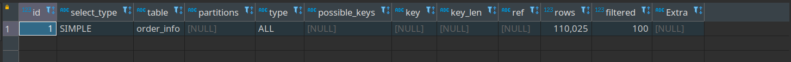

        2. PRIMARY 最外层的查询
            ```sql
            explain select 
                * 
            from 
                (
                    select id, name from user_info where phone_num like '136%'
                    UNION 
                    select id, name from user_info where name like '李%'
                ) t
                LEFT JOIN order_info o on o.user_id = t.id
            ```

            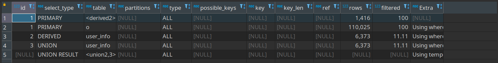
            
            可以看到因为有比较复杂的子查询语句，所以最外层针对表o(order 表的别名)的查询类型为PRIMARY。这里还有一个针对表<derived2>的查询被标注为了PRIMARY，这个查询是针对派生表的查询
        
        3. UNION
            第二个及之后的select出现在union之后，被标注为union 
            我们在上述例子中可以看到，针对user表的第二个查询 `select id,name from user_info where name like '李%'` 被标注为了union，这是因为这个 `select出现在union之后，并且是第三个出现的select` 了

        4. UNION RESULT 从union临时表中检索结果的select
            从上述的例子中可以看到针对union的临时表<union2,3>的查询，其实也就是查询出来形成我们的表t，这个`针对union临时表的查询被标注为了UNION RESULT`
        
        5. DERIVED 派生表
            表示包含在from子句的子查询中的select 上述例子中的 `select id,name from user_test.user where phone_num like '136%'` 子查询被标注为了DERIVED，这是因为该表是 `在from之后的子查询中的select`

        6. DEPENDENT UNION 在union中的第二个或者之后的查询，并且外部查询依赖于union的结果
            ```sql
            explain select 
                * 
            from 
                user_info 
            where 
                id IN
                (
                    select user_id from order_info where consignee like '136%'
                    UNION 
                    select user_id from order_info where order_status = '1005'
                )
            ```

            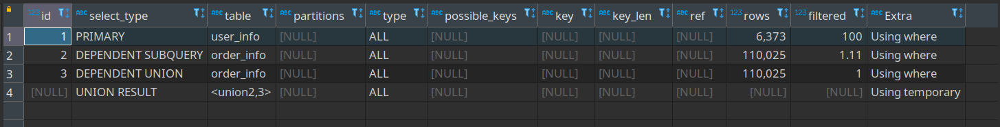

            从执行结果可以看到，子句 `select user_id from order_info where order_status = '1005'` 因为是属于union子句，该union产生的结果与外部查询有直接关系，外部查询的结果依赖于这里union的结果
        
        7. subquery 在select或者where列表中包含的子查询
            ```sql
            explain select
                *
            from 
                order_info
            where 
                total_amount > (select avg(total_amount) from order_info)
            ```

            可以看到where后的子查询 `select avg(total_amount) from order_info` 被标注为了subquery

            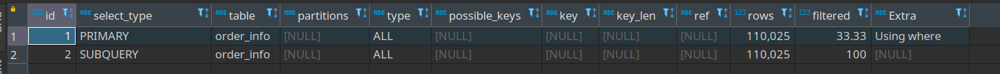

        8. dependent subquery
            在select或者where列表中包含的子查询，并且外部查询依赖于select的结果 理解了上述的dependent union，再来理解dependent subquery会更好理解一些，实际上在我们的案例6中出现的第一个子句 `select user_id from order_info where consignee like '136%'` 就已经被标注为dependent subquery，这是因为该子查询的结果直接影响了外部查询的结果

        9. UNCACHEABLE SUBQUERY 无法缓存的子查询
            ```sql
            explain select
                *
            from 
                order_info
            where 
                total_amount > (select avg(total_amount) from order_info where total_amount > @max_connections)
            ```

            `@max_connections` 是mysql的参数，当语句中使用了mysql参数时，就不会将该结果进行缓存，所以我们可以看到查询子句被标注为了UNCACHEABLE SUBQUERY，当然不是只有使用了mysql参数的语句会被标注为UNCACHEABLE，具体要根据sql语句来分析

            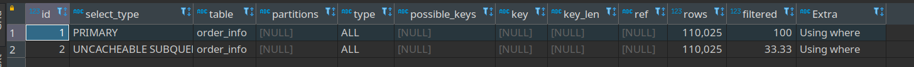

        10. UNCACHEABLE UNION 无法缓存的union
            ```sql
            explain select 
                * 
            from 
                (
                    select user_id from order_info where consignee like '136%'
                    UNION 
                    select user_id from order_info where total_amount > @max_connections
                ) t 
            ```

            结论同上，@@max_connections是mysql的参数，当语句中使用了mysql参数时，就不会将该结果进行缓存，所以我们可以看到查询子句被标注为了UNCACHEABLE UNION

            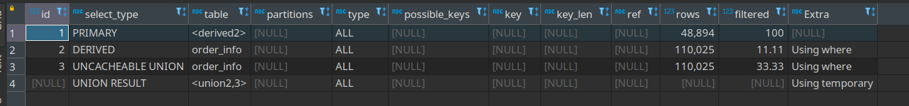
    
    3. table 表名
        正在对拿个表进行访问，如果声明了表的别名，就会显示别名。同时也可能是临时表、派生表或者union合并表，如我们上述中的例子所示的 `<union2,3>` ,`<derived2>` 

        派生表：`<derivedN>` 形式，N表示产生派生表的查询的queryId 合并表： `<unionN1,N2>` 形式，N2,N2表示参与union的查询的queryId

    4. partitions 匹配的分区
        mysql中提供了分区功能，可以将表数据按照一定的规则进行分区，比如按照创建时间进行分区，这样就可以将创建时间久远的数据分到冷数据区，这类数据访问量少，分配的资源就少，创建时间近的分到热数据区，这类数据访问频繁，分配的资源就多，以此实现冷热数据分离，提高查询效率

        所以如果表开启了分区功能的，就会显示该sql涉及到的分区，如果没有开启分区，就会显示为空

    5. type 连接类型
        连接类型/访问类型，表示该sql是以何种方式访问的数据，比较常见的是全表扫描，就是简单粗暴的将全表便利一遍找到我们想要的数据，这种方式效率非常低下

        所以引入了索引的概念，基于索引，我们将连接类型分为以下几种

        1. system：表中只有一行记录，一般只出现在一些系统表中，业务表很少出现
        2. const：该表最多有一条匹配的行 在查询开始时被读取。因为只有一行，这一行中的列的值可以被优化器的其他部分视为常数。常数表非常快，因为它们只被读取一次
            ```sql
            explain select * from order_info where id=10;
            ```

            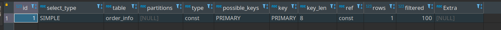

        3. eq_ref：使用唯一索引进行数据查找 当使用的是主键索引或者唯一索引来进行连接使用时就会使用eq_ref
        4. ref：对于先前表中的每个行组合，从该表中读取具有匹配索引值的所有行。ref如果连接仅使用键的最左前缀或键不是 一个PRIMARY KEY或 UNIQUE索引（换句话说，如果连接不能基于键值选择单行），则使用。如果使用的键只匹配几行，这是一个很好的连接类型。 
        5. fulltext：使用全文索引进行的数据查找
        6. ref_or_null：某个字段即需要关联条件，也需要null值的情况
        7. index_merge：需要多个索引组合使用进行的数据查找
        8. unique_subquery：利用唯一索引来关联子查询
        9. index_subquery：利用索引来关联子查询
        10. range：利用索引查询时限制了范围 适用的操作符：=,like 'xxx%',>,<,>=,<=,between and,is null,or in
        11. index：全索引扫描 当我们需要的数据在索引中就能查找到，或者需要用到索引进行排序时其连接类型就是index
        12. ALL：全表扫描 
        
        * 以上访问类型的效率从高到低依次是： system > const > eq_ref > ref > fulltext > ref_or_null > index_merge > unique_subquery > index_subquery > range > index > ALL
    
    6. possible_keys 可能会选择的索引
        显示可能会在这张表中使用的索引，查询中涉及到的列如果是索引列则可能会被列出显示出来，但不一定在查询中实际使用
    
    7. key 实际选择的索引
        查询中实际使用的索引
    
    8. key_len 索引的长度
        索引中使用的字节数

    9. ref 索引的哪一列被引用了

    10. rows 估计要扫描的数据行数
        这时个预估值，非常重要的参数，我们可以通过该参考了解到sql执行需要查找多个行数据，只要能查找我们想要的结果，该值越少越好

    11. filtered 符合查询条件的数据百分比
        符合查询条件的数据百分比

    12. extra 拓展信息

3. 执行计划并不是一定是最佳
有时候mysql选择的执行计划并不一定是最佳的，所以执行计划的结果仅仅是个优化的参考值而不是一定值。执行计划的选择受以下因素的影响：
    1. 统计信息不准确，因为innodb采用MVCC机制（多版本并发控制），导致查询的数据并不一定是实际数据，于是执行计划预估的成本不等于实际成本 
    2. mysql的优化基于成本模型的优化，所以并不一定是最快的优化 
    3. mysql不会考虑其他并发执行的查询，但是实际执行是会有并发的 
    4. mysql不考虑不受控制的操作成本，如存储过程或者用户自定义函数的成本